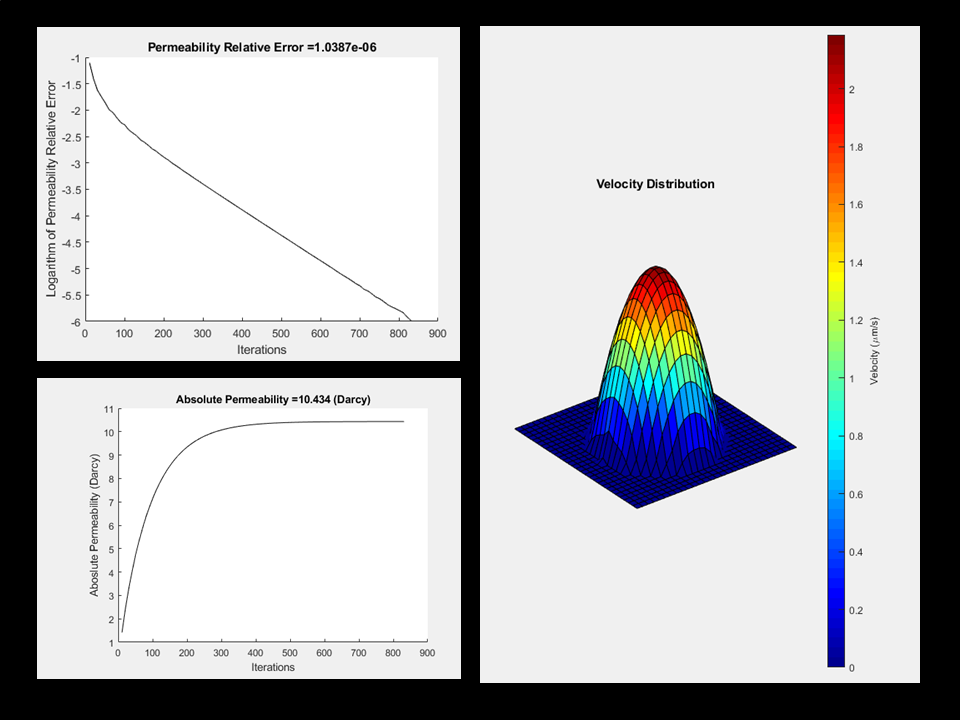

# Image-based Throat Permeability Model

Image-based tube/throat permeability model is a mean to find the absolute permeability of a tube with arbitrary cross-section this function can use 4 methods for estimating the absolute permeability: 1) Lattice Boltzmann simulation, 2) An artificial neural network with 1 input parameter, 3) Another artificial neural network with 7 input parameters and, 4) an empirical correlation which uses the average distance values of the transformed input images

Inputs: A: is a binary image in which void space is 0 and solid space is 1, this image shows the cross-section of the throat/tube Res: is the spatial resolution and it is expressed as micron/pixel Method: asks that what method you wanted to use for permeability calculation the values could be: LBM, EMP, ANN1P, and ANN7P. Plot: when putting as 1 it will show the LBM convergence charts and if set to zero it won't

Output: Absolute Permeability of throat/tube in Darcy

The LBM section is adapted from this source: Haslam, I. W., Crouch, R. S., & Seaïd, M. (2008). Coupled finite element–lattice Boltzmann analysis. Computer Methods in Applied Mechanics and Engineering, 197(51-52), 4505-4511.

If you are using ITPM in your research, please cite this article:

Hybrid Pore network and Lattice Boltzmann Permeability modeling accelerated by machine learning, Arash Rabbani, Masoud Babaei, Journal of Advances in Water Resources, 2019. [(Link)](https://www.sciencedirect.com/science/article/pii/S0309170818311059)

Note: In order to run this code on MATLAB, you need to have Image Processing and Neural Fitting Toolboxes

